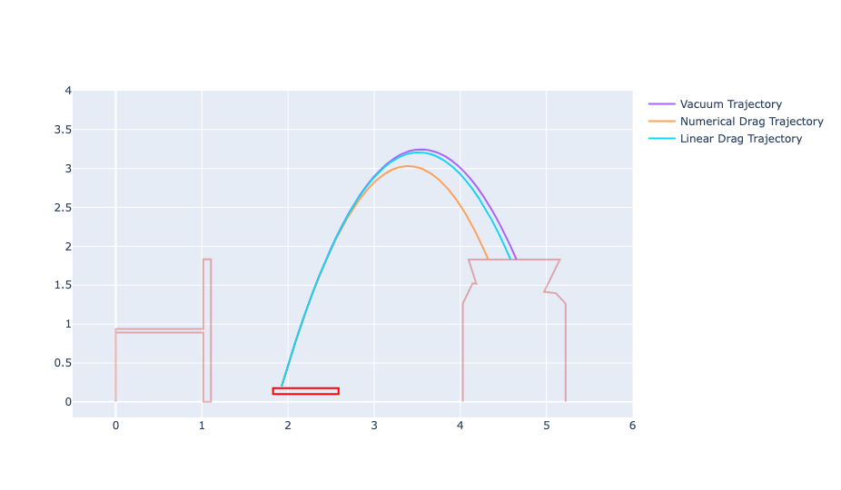

Taking a look at the trajectory of the ball.

We look at the analytical trajectory in a vacuum.

Then we look at adding the standard nonlinear drag term, numerically integrating the resulting equations of motion, and comparing the results to the analytical solution

Finally we explore modifying the drag term to be linear so that we can come up with an analytical solution, and compare that to the previous two solutions.

An example of the final result:

To explore further, run the traj.py script with marimo and uv, i.e. `uvx marimo edit traj.py`

